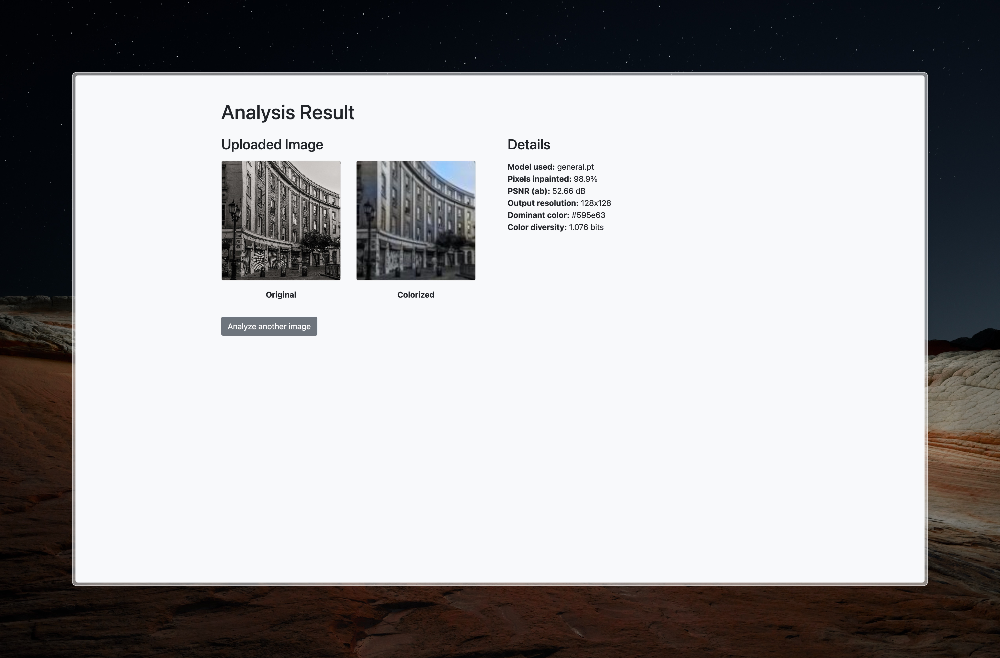
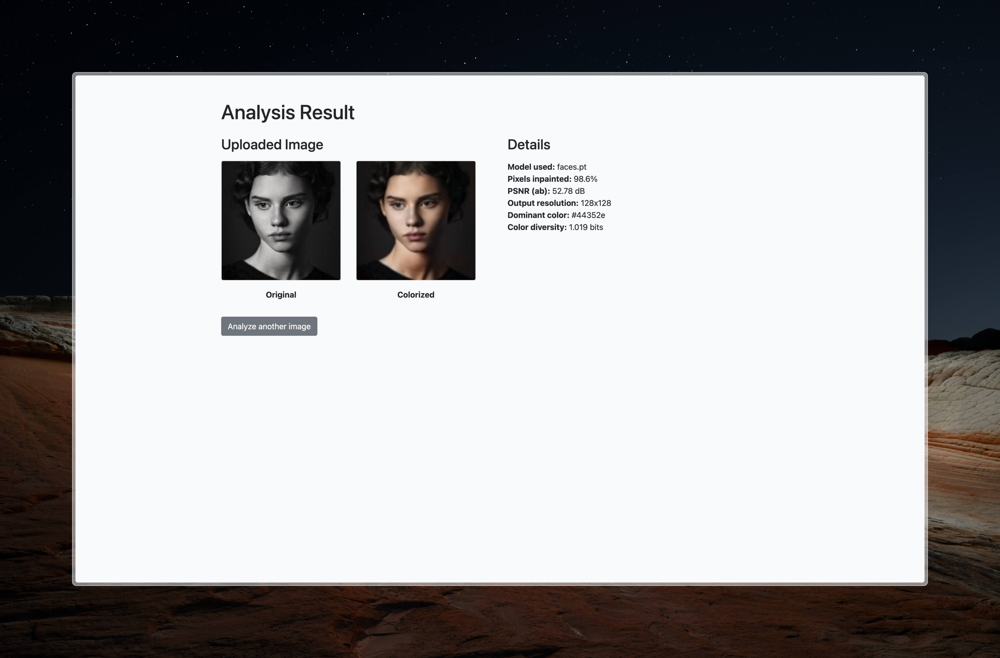

# Context Color

Colorizing black-and-white images is a complex and underconstrained problem—one where the same grayscale input can correspond to many plausible color versions. This project explores how convolutional neural networks (CNNs) can learn to colorize images based on context, mimicking human intuition in assigning realistic hues to objects, backgrounds, and faces.

Inspired by the approach in [*Colorful Image Colorization* (Zhang et al.)](https://doi.org/10.48550/arXiv.1603.08511), this project implements and trains neural models capable of generating vibrant, context-aware colorizations from grayscale input. The goal is to study how deep learning can be used to "hallucinate" color in a way that is both visually compelling and semantically meaningful.

## App Demo

Example of general colorization:



Example of specific portrait colorization:



## Data

This project uses two datasets to train separate models: one general-purpose model trained on the [COCO dataset](https://cocodataset.org/), and a face-specialized model trained on the [CelebA dataset](http://mmlab.ie.cuhk.edu.hk/projects/CelebA.html). COCO provides diverse everyday scenes, while CelebA contains over 200,000 celebrity face images ideal for facial feature learning.

For detailed download instructions, see [data](data/README.md).

## Usage

To run the project, first clone the repository:

```bash
git clone https://github.com/SepehrAkbari/context-color.git
cd context-color
```

Create a virtual environment (optional but recommended):

```bash
python -m venv .venv
source .venv/bin/activate
```

Install the dependencies:

```bash
pip install -r requirements.txt
```

To launch the Flask app:

```bash
cd app
flask run
```

To train your own model, run the training in the model's directory:

```bash
cd src/general
python train.py
cd ../faces
python train.py
```

To explore the analysis, run the Jupyter Notebook located in the `Notebook` folder:

```bash
jupyter notebook notebooks/context-color.ipynb
```

## Approach

## Approach

- **Data Preparation**  
  - **Portrait model:** using CelebA aligned-crop faces, center-crop to square, resizing to 128×128, converting RGB to LAB and splitting it into L (input) and ab (target) channels.  
  - **General model:** sampling COCO train2017 images, apply the same LAB conversion and resizing.

- **ColorNet Architecture**  
  - **Encoder:** Stacked convolutional blocks with downsampling to extract deep features from the single‐channel L input.  
  - **Decoder:** learned upsampling blocks (nearest-neighbor + conv) that expand back to original resolution and predict the two‐channel ab output.  
  - **Skip connections:** U-Net style shortcuts to preserve spatial detail and sharp edges.

- **Training**  
  - **Regression loss:** L1 reconstruction loss on predicted ab channels (we omit Zhang’s classification over quantized bins for simplicity).  
  - **Optimizer & schedule:** Adam with weight decay, ReduceLROnPlateau to halve the learning rate on validation plateaus, and early stopping after several non-improving epochs.  
  - **Mixed precision:** AMP autocasting + gradient scaling for faster, lower-memory training.

- **Inference & Post-processing**  
  - **Direct colorization:** feed any grayscale L input through the trained ColorNet to predict ab channels.  
  - **Iterative in-painting:** detect any near-zero “holes” in ab, then apply OpenCV’s Telea inpainting iteratively to produce almost-fully colored output.

## Contributing

To contribute to this project, you can fork this repository and create pull requests. You can also open an issue if you find a bug or wish to make a suggestion.

## License

This project is licensed under the [GNU General Public License (GPL)](/LICENSE).